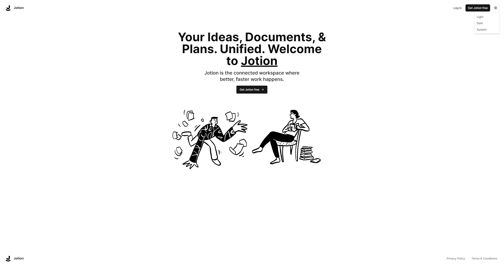

## 🛠️ Stack

- [**Next.js**](https://nextjs.org/) - The web framework for high-quality web applications.
- [**Typescript**](https://www.typescriptlang.org/) - JavaScript with syntax for types.
- [**Convex**](https://www.convex.dev/) - The fullstack TypeScript development platform.
- [**Clerk**](https://clerk.com/) - The authentication and user management platform.
- [**Zustand**](https://zustand-demo.pmnd.rs/) - The lightest global state manager.
- [**Tailwindcss**](https://tailwindcss.com/) - A utility-first CSS framework for rapidly building custom designs.
- [**Shadcn/UI**](https://ui.shadcn.com/) - Beautifully designed components that you can copy and paste into your apps. Accessible. Customizable. Open Source.
- [**Sonner**](https://sonner.emilkowal.ski/) - An opinionated toast component for React.
- [**Lucide React**](https://lucide.dev/guide/packages/lucide-react) - Beautiful and consistent icons

## Key Features:

- Real-time database 🔗
- Notion-style editor 📝
- Light and Dark mode 🌓
- Infinite children documents 🌲
- Trash can & soft delete 🗑️
- Authentication 🔐
- File upload
- File deletion
- File replacement
- Icons for each document (changes in real-time) 🌠
- Expandable sidebar ➡️🔀⬅️
- Full mobile responsiveness 📱
- Publish your note to the web 🌐
- Fully collapsable sidebar ↕️
- Landing page 🛬
- Cover image of each document 🖼️
- Recover deleted files 🔄📄

## Prerequisites

**Node version 18.x.x**

### Cloning the repository

```shell
git clone https://github.com/patchitodev/jotion-notion-clone.git
```

### Install packages

```shell
npm i
```

### Setup .env file

```js
# Deployment used by `npx convex dev`
CONVEX_DEPLOYMENT=
NEXT_PUBLIC_CONVEX_URL=

NEXT_PUBLIC_CLERK_PUBLISHABLE_KEY=
CLERK_SECRET_KEY=

EDGE_STORE_ACCESS_KEY=
EDGE_STORE_SECRET_KEY=
```

### Setup Convex

```shell
npx convex dev

```

### Start the app

```shell
npm run dev
```
